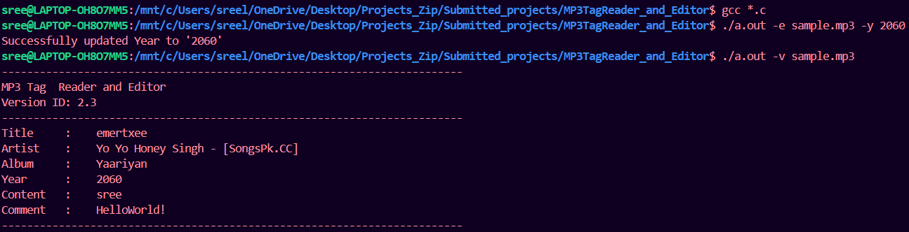
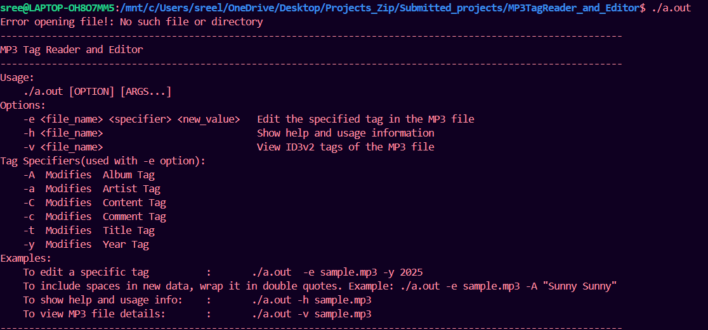

# MP3 Tag Reader and Editor

A command-line utility to **read and edit ID3v2 tags** (like title, artist, album, year, etc.) in MP3 files without altering the audio content.

---

## Table of Contents

- [Features](#features)
- [Prerequisites](#prerequisites)
- [Building](#building)
- [Usage](#usage)
  - [View Tags](#view-tags)
  - [Edit Tags](#edit-tags)
  - [Help](#help)
- [How It Works](#how-it-works)
  - [Tag Identification](#tag-identification)
  - [Reading Tags](#reading-tags)
  - [Editing Tags](#editing-tags)
- [Project Structure](#project-structure)
- [Error Handling](#error-handling)
- [Output](#output)
- [Author](#author)

---

## Features

- 🎵 **Read ID3v2 Tags** like Title, Artist, Album, Year, Genre, and Comments from MP3 files.
- ✏️ **Edit Tags** directly in the MP3 file using command-line options.
- 🔒 Preserves MP3 content while editing metadata.
- 📦 Simple CLI usage with clear prompts and outputs.
- ⚙️ Endian-safe reading and writing for tag size handling.
- 📁 Modifies original file in-place (with safety renaming).

---

## Prerequisites

- A C99-compatible compiler (e.g., `gcc`)
- Basic understanding of terminal/command-line usage
- An MP3 file with ID3v2 tags

---

## Building

```bash
# Compile the project
gcc *.c

```

---

## Usage

### View Tags

```bash
./a.out -v <MP3_FILE>
```

**Example:**

```bash
./a.out -v sample.mp3
```

---

### Edit Tags

```bash
./a.out -e <MP3_FILE> <TAG_SPECIFIER> <NEW_VALUE>
```

**Tag Specifiers:**

| Specifier | Tag     |
|-----------|---------|
| `-t`      | Title   |
| `-a`      | Artist  |
| `-A`      | Album   |
| `-y`      | Year    |
| `-C`      | Genre   |
| `-c`      | Comment |

**Example:**

```bash
./mp3_editor -e sample.mp3 -A "Best of 2025"
```

> ✅ Automatically overwrites the old tag and saves the new one.  
> ⚠️ Spaces in new value must be wrapped in quotes.

---

### Help

```bash
./mp3_editor -h <MP3_FILE>
```

---

## How It Works

### Tag Identification

- Confirms the file starts with the `ID3` signature.
- Reads version byte and interprets as ID3v2.x.

### Reading Tags

- Skips the 10-byte header.
- Reads and matches known tag headers (`TPE1`, `TIT2`, etc.).
- Converts tag size from big-endian to little-endian for processing.
- Displays values without affecting the original file.

### Editing Tags

- Creates a temporary output file (`sample_edit.mp3`).
- Replaces only the specified tag’s content.
- Preserves all other data and structure.
- Replaces original file after successful editing.

---

## Project Structure

```
.
├── main.c              # Entry point and CLI parsing
├── functions.c         # Core tag reading and editing logic
├── functions.h         # Function prototypes
├── sample.mp3          # Sample MP3 for testing
└── a.out               # Compiled binary (optional output)
```

---

## Error Handling

- Exits with error if:
  - File cannot be opened
  - Invalid MP3 header
  - Memory allocation fails
  - Unknown tag specifier
- Ensures:
  - Clean file closure
  - Safe overwrite with backup file creation

---

## Output

### ✅ Editing and Viewing Tags



*After compiling, a tag is updated (e.g., Year → 2060), and tag info is displayed using `-v`.*

---

### ❌ Error Handling and Help Menu



*Displays help menu and error when a non-existent file is passed.*

---


## Author

**Sreelakshmi Vinod**  
Passionate about embedded systems and low-level programming.  
